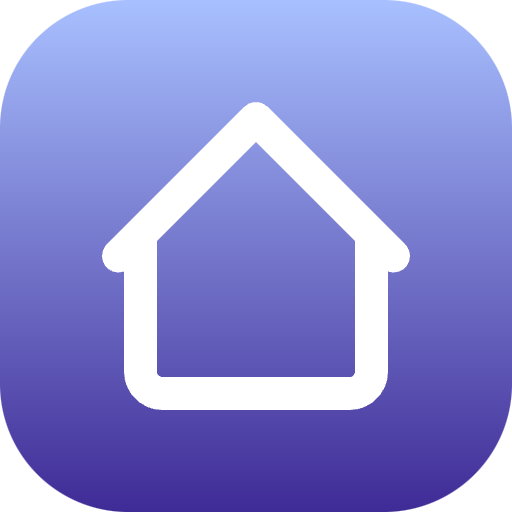

<h1 align="center">
   
  
   
  Homelab
   
</h1>

<h4 align="center">My homelab </h4>

## Key Features

* Talos k8s vms
* Deployed on proxmox with Terraform
* GitOps systems with Portainer and fluxcd

## Architecture diagram

## Made with

This software uses the following open source packages:

### Virtualization

* Proxmox
* Docker
* Cloud init
* Talos

### IaC tools

* Packer
* Terraform
* Ansible
* FluxCD

### k8s systems

* k3s
* Helm
* ArgoCD
* ClusterAPI
* Traefik
* Cert-manager
* Nfs file provisioner
* MetalLB
* Vault
* Authentik
* ESO
* GitLab
* Seaweedfs S3
* Dragonfly DB

### Docker systems

* Portainer GitOps
* Nginx proxy manager
* Keepalived
* HAproxy
* Clodflare tunnel
* Twingate
* SornarQube
* Arrstack with monitoring

### Monitoring

* Prometheus
* Grafana
* AlertManager
* Loki
* Alloy
* FluentBit

### Git

* GitHub actions
* Linters

## Architecture diagram v1

## Architecture diagram v2

